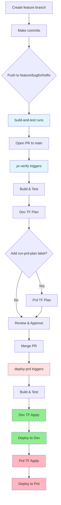

# Development Workflows

Target: Engineers working on portal-sync (function app). Covers branch strategy, CI/CD triggers, and typical development flows.

## Branch Strategy & Triggers

### Feature Development feature/*, bugfix/*, hotfix/*
- **build-and-test.yml**: Runs on push to feature/bugfix/hotfix branches
  - Build and test via `dotnet-func-ci` composite action targeting .NET 9
  - No Terraform or deployments
  - Purpose: fast feedback on WIP changes

### Pull Requests → main
- **pr-verify.yml**: Validation pipeline (runs on PR open, updates, reopen, and ready for review)
  - Build and test
  - Terraform plan for dev (skips for dependabot and copilot/* unless labeled)
  - Terraform plan for prd (requires `run-prd-plan` label; copilot branches also require `run-dev-plan`)
  - Concurrency groups prevent parallel dev/prd operations

### Main Branch on merge
- **deploy-prd.yml**: Promotion pipeline
  - Build → Dev plan/apply → Deploy Dev → Prd plan/apply → Deploy Prd
  - Triggers: push to `main`, weekly schedule (Thu 3am UTC), manual dispatch
  - Workflow-level concurrency serializes runs

### Scheduled & On-Demand
- **codequality.yml**: Weekly Monday 3am UTC + on PR/push to main
  - SonarCloud analysis
- **deploy-dev.yml**: Manual dispatch
  - Build → Dev plan/apply → Deploy Dev
- **devops-secure-scanning.yml**: Weekly Thursday 2am UTC + PR/push to main; uploads SARIF results
- **destroy-development.yml** / **destroy-environment.yml**: Manual destroys for dev or targeted environments

## Standard Developer Flow

### Local Development
```bash
# Standard validation sequence
cd src/XtremeIdiots.Portal.Sync.App
dotnet clean
dotnet build
dotnet test --filter "FullyQualifiedName!~IntegrationTests"
```

### Feature Branch → PR → Merge Flow



## Copilot Agent Flow

- Copilot branches (`copilot/*`) skip Terraform plans by default in **pr-verify.yml**
- Add `run-dev-plan` label to enable the dev plan; add both `run-dev-plan` and `run-prd-plan` to run the prd plan
- Setup requirements are defined in **copilot-setup-steps.yml** (checkout + .NET 9.0.x)

## Composite Actions (frasermolyneux/actions)

- **dotnet-func-ci**: Build and test function app
- **terraform-plan** / **terraform-plan-and-apply**: Init, plan, and optionally apply
- **deploy-function-app**: Deploy Azure Function App

## Quick Reference

| Scenario           | Workflow       | Trigger                  | Terraform     | Deploy  |
| ------------------ | -------------- | ------------------------ | ------------- | ------- |
| Feature commit     | build-and-test | Push to feature/bugfix   | ❌             | ❌       |
| PR validation      | pr-verify      | PR to main               | Dev plan      | ❌       |
| Merge to main      | deploy-prd     | Push to main             | Dev+Prd apply | Dev+Prd |
| Manual dev refresh | deploy-dev     | Manual dispatch          | Dev apply     | Dev     |
| Weekly maintenance | deploy-prd     | Thursday 3am UTC         | Dev+Prd apply | Dev+Prd |
| Code quality       | codequality    | Monday 3am UTC + PR/push | ❌             | ❌       |

## Environment Secrets

OIDC authentication uses GitHub environment variables (not secrets):
- `AZURE_CLIENT_ID`: Service principal app ID
- `AZURE_TENANT_ID`: Azure AD tenant
- `AZURE_SUBSCRIPTION_ID`: Target subscription

Defined in **Development** and **Production** environments within GitHub repository settings.
